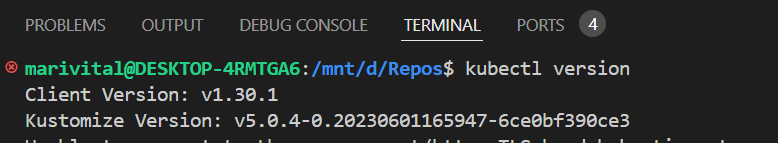
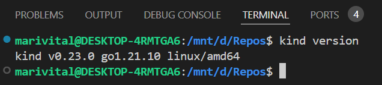

# Qual distro utilizar?
Ubuntu, Debian, CentOS e afins.  

#
# Kubectl
Ferramenta de linha de comando que pode ser usada para interagir com seus clusters


## Instalar o binário kubectl com curl no Linux 

Download da última versão
````
curl -LO "https://dl.k8s.io/release/$(curl -L -s https://dl.k8s.io/release/stable.txt)/bin/linux/amd64/kubectl"
````

Instalar o pacote baixado do kubectl

````
sudo install -o root -g root -m 0755 kubectl /usr/local/bin/kubectl
````

Confirmar se a instalação está atualizada com a última versão
````
kubectl version 
````


#
# Kind
Ferramenta para execução de contêineres Docker que simulam o funcionamento de um cluster Kubernetes

## Baixar binário

````
# For AMD64 / x86_64
[ $(uname -m) = x86_64 ] && curl -Lo ./kind https://kind.sigs.k8s.io/dl/v0.23.0/kind-linux-amd64
# For ARM64
[ $(uname -m) = aarch64 ] && curl -Lo ./kind https://kind.sigs.k8s.io/dl/v0.23.0/kind-linux-arm64
chmod +x ./kind
````

## Mover o pacote para o diretório de preferência

````
sudo mv ./kind /usr/local/bin/kind
````

Confirmar a instalação

````
kind --version
````

